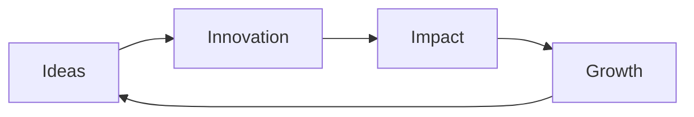

# Welcome to Fusion Script 🚀


## Innovating the Future, One Line of Code at a Time

At Fusion Script, we're not just writing code; we're crafting the future. Our passion lies in pushing the boundaries of what's possible in the digital realm, creating solutions that inspire and transform.

### 🌟 What We Do

- **Innovative Software Development**: Cutting-edge solutions tailored to meet the evolving needs of businesses and individuals.
- **Expert Insights**: Sharing knowledge and trends that shape the industry.
- **Future-Ready Technologies**: Embracing and implementing the latest in tech to keep you ahead of the curve.

### 💡 Our Vision

To be the catalyst for digital innovation, empowering businesses and individuals to thrive in an ever-changing technological landscape.

### 🛠 Technologies We Love

```
Python | JavaScript | React | Node.js | AWS | Docker | Machine Learning
```

### 🌐 Connect With Us

- [Website](https://www.fusionscript.com)
- [LinkedIn](https://www.linkedin.com/company/fusionscript)
- [Twitter](https://twitter.com/fusionscript)
- [Blog](https://blog.fusionscript.com)

### 📈 Our Impact



### 🤝 Let's Collaborate

Are you ready to embark on a journey of digital transformation? Whether you're a startup with a groundbreaking idea or an enterprise looking to revolutionize your industry, we're here to turn your vision into reality.

> "The best way to predict the future is to create it." - Peter Drucker

Join us in shaping the future of technology. Let's create something extraordinary together!

---

⭐️ Don't forget to star our repositories if you find them helpful!
