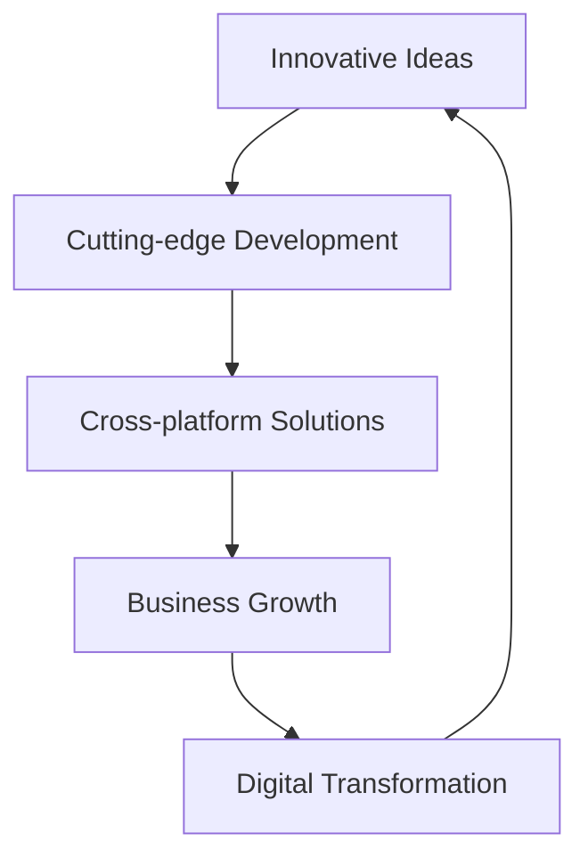

# Welcome to Fusion Script 🚀


## Innovating the Future, One Line of Code at a Time

At Fusion Script, we're not just writing code; we're crafting the future. Our passion lies in pushing the boundaries of what's possible in the digital realm, creating solutions that inspire and transform.

### 🌟 What We Do

We specialize in comprehensive software solutions across multiple platforms:

- **Web Application Development**: Crafting responsive, scalable web applications using cutting-edge technologies.
- **Mobile Application Development**: Building intuitive and powerful apps for iOS and Android platforms.
- **Desktop Application Development**: Creating robust software solutions for Windows, macOS, and Linux.
- **Custom Business Applications**: Tailoring bespoke software to meet unique business needs and challenges.
- **MERN Stack Expertise**: Leveraging MongoDB, Express.js, React, and Node.js for full-stack JavaScript solutions.
- **Innovative Software Development**: Cutting-edge solutions tailored to meet the evolving needs of businesses and individuals.
- **Future-Ready Technologies**: Embracing and implementing the latest in tech to keep you ahead of the curve.

### 💡 Our Vision

To be the catalyst for digital innovation, empowering businesses and individuals to thrive in an ever-changing technological landscape.

### 🛠 Technologies We Love

```
Web: HTML5 | CSS3 | JavaScript | React | Angular | Vue.js
Mobile: React Native | Flutter | Swift | Kotlin
Desktop: Electron | .NET | Java
Backend: Node.js | Python | Java | C# | PHP
Database: MongoDB | MySQL | PostgreSQL | Oracle
Cloud: AWS | Azure | Google Cloud
DevOps: Docker | Kubernetes | Jenkins
```

### 🏆 Our Core Competencies

1. **Web Applications**
   - Progressive Web Apps (PWAs)
   - Single Page Applications (SPAs)
   - E-commerce platforms
   - Content Management Systems (CMS)

2. **Mobile Applications**
   - Cross-platform development
   - Native iOS and Android apps
   - Mobile-first user experiences

3. **Desktop Applications**
   - Cross-platform desktop solutions
   - High-performance native applications
   - System utilities and productivity tools

4. **Custom Business Applications**
   - ERP (Enterprise Resource Planning) systems
   - CRM (Customer Relationship Management) tools
   - Business process automation
   - Data analytics and visualization dashboards

5. **MERN Stack Development**
   - Full-stack JavaScript solutions
   - Scalable and efficient NoSQL database design
   - RESTful API development

### 🌐 Connect With Us

- [Website](https://www.fusionscript.com)
- [LinkedIn](https://www.linkedin.com/company/fusionscript)
- [Twitter](https://twitter.com/fusionscript)
- [Blog](https://blog.fusionscript.com)

### 📈 Our Impact



### 🤝 Let's Collaborate

Are you ready to embark on a journey of digital transformation? Whether you need a web, mobile, or desktop application, or a custom business solution, we're here to turn your vision into reality. Our diverse expertise ensures that your project will be built on a solid, modern foundation across any platform.

> "Innovation distinguishes between a leader and a follower." - Steve Jobs

Join us in shaping the future of technology. Let's create something extraordinary together!

---

⭐️ Don't forget to star our repositories if you find them helpful!
